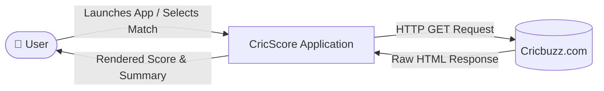
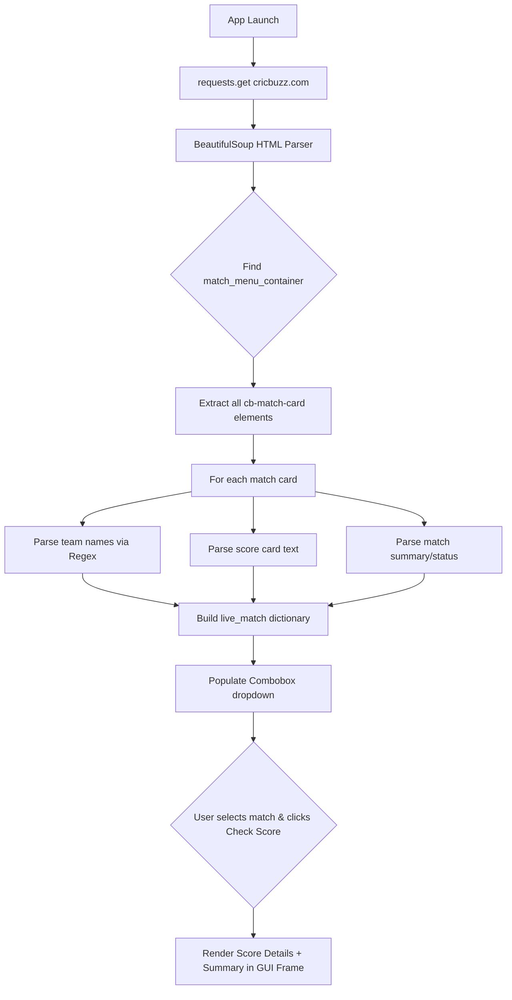
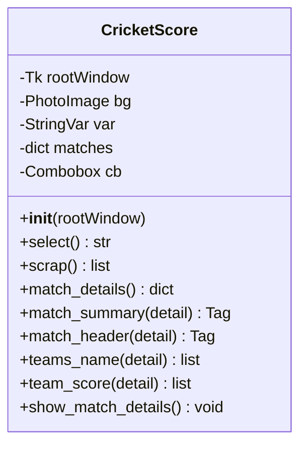

# 🏏 CricScore — Live Cricket Score Tracker

A desktop GUI application that scrapes **Cricbuzz.com** in real time and displays live scores, match summaries, and status for every ongoing/upcoming cricket match — built with Python, Tkinter, and BeautifulSoup.


---

## 📌 Problem Statement

During the cricket season, fans want quick, no-clutter access to live match info — team names, current scores, and a one-line summary of who's batting/bowling — without opening a browser or a bloated sports app.

**CricScore** solves this with a lightweight native desktop tool: pick a live match from a dropdown, hit **Check Score**, and see the details instantly.

---

## ✨ Features

- 🔴 **Live data** — scrapes Cricbuzz's homepage on launch, no static/mock data
- 📋 **Match selector** — dropdown lists every live/upcoming match found
- 📊 **Score card** — both teams' current score and overs in one view
- 📝 **Match summary** — status line (e.g. "India need 45 runs in 30 balls")
- 🖥️ **Native desktop GUI** — no browser, no internet tab clutter

---

## 🏗️ Architecture — Data Flow Diagram (DFD)

### Level 0 — Context Diagram



### Level 1 — Process Breakdown



---

## 🧩 Class Design



The entire application is modeled as a **single cohesive class** — `CricketScore` — following OOP principles: the GUI, scraping logic, and parsing logic are separated into distinct methods with single responsibilities, while sharing state (`self.matches`, `self.cb`) as instance attributes.

---

## 🛠️ Tech Stack

| Layer            | Technology                          |
|-------------------|-------------------------------------|
| GUI               | Tkinter, tkinter.ttk (Combobox)     |
| HTTP Client       | `requests`                          |
| HTML Parsing      | `BeautifulSoup4` (bs4)              |
| Image Rendering   | `Pillow` (PIL)                      |
| Pattern Matching  | `re` (Regex)                        |
| Language          | Python 3.12                         |

---

## 📂 Project Structure

```
cricscore-live-tracker/
├── assets/
│   └── cric.jpg          # GUI background image
├── main.py                # Application entry point (OOP implementation)
├── requirements.txt        # Python dependencies
└── README.md
```

---

## ⚙️ Installation & Setup

```bash
# 1. Clone the repository
git clone https://github.com/Aman1-23/cricscore-live-tracker.git
cd cricscore-live-tracker

# 2. Install dependencies
pip install -r requirements.txt

# 3. Run the application
python main.py
```

> **Note:** Tkinter ships with the standard Python installation on most systems — no separate install required.

---

## 🖥️ Preview

The dropdown lists all live matches scraped from Cricbuzz; selecting one and clicking **Check Score** renders the score card and summary inline.

*(See `assets/cric.jpg` for the background used in the running app — add a screenshot of the live running GUI here before publishing, e.g. `assets/demo.png`.)*

---

## 🧠 Key Learnings

- Structuring a scraping + GUI pipeline using **OOP** so state (scraped data) and behavior (rendering) stay decoupled but accessible via `self`.
- Handling **fragile HTML structures**: Cricbuzz's class names (`cb-hmscg-bat-txt`, `cb-mtch-crd-state`, etc.) can change without notice — a real-world lesson in why scraping is inherently brittle compared to using an official API.
- Using **Regex** to cleanly separate team names from concatenated score strings (e.g., splitting `"India285/7"` into `"India"` and `"285/7"`).

---

## ⚠️ Known Limitations

- Scraping depends entirely on Cricbuzz's current HTML class names — if the site's structure changes, the parser will need updates.
- No caching/refresh mechanism — data is fetched once at launch (selecting "Check Score" does not re-fetch).
- No persistence layer — scores aren't stored anywhere; the app is a real-time viewer only.

---

## 🚀 Future Roadmap

These are **planned, not yet implemented** — listed transparently rather than claimed as built:

- [ ] Auto-refresh scores every N seconds instead of only at launch
- [ ] Store scraped snapshots in a database (e.g. MySQL/SQLite) to enable historical analysis
- [ ] Add SQL-based analytics on stored match history (matches by status, top venues, etc.)
- [ ] Visualize historical trends with matplotlib/seaborn dashboards
- [ ] Migrate scraping to an official cricket API (e.g. CricAPI) to remove scraping fragility
- [ ] Package as a standalone `.exe` using PyInstaller for non-technical users

---

## 👤 Author

**Aman Kumar**
- GitHub: [@Aman1-23](https://github.com/Aman1-23)
- LinkedIn: [aman-kumar-96a28a372](https://linkedin.com/in/aman-kumar-96a28a372)
- LeetCode: [Aman8886](https://leetcode.com/u/Aman8886/)
- Email: amank273054@gmail.com

---

## 📄 License

This project is open-sourced for educational purposes.
